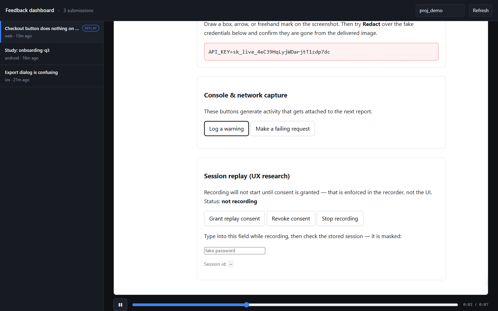

# Cross-platform feedback & UX research SDK

Bug reporting, research responses, and session replay for web, iOS and Android,
delivered into one ingest pipeline.

The premise: Marker.io is web-only and has no mobile SDK. Native mobile is the gap.

## Layout

```
packages/core       Platform-agnostic TS. Schema, consent, ingest client, offline queue.
packages/web        Browser SDK. Screenshot, annotation, replay (rrweb).
apps/dashboard      Operator UI. Submission list, detail, replay playback.
services/ingest     Ingest API + serves the dashboard.
examples/demo       Runnable demo + privacy test fixture.
platforms/android   Kotlin library. Builds; 31 unit tests pass.
platforms/ios       Swift package. NEVER COMPILED — see below.
```



## Try it

```bash
npm install
npm run ingest        # API + dashboard on :4000
npm run seed          # records a real session, seeds 3 submissions
open http://localhost:4000
```

`seed` drives a real browser to produce a genuine screenshot and genuine rrweb
events rather than fixtures — fixtures would only prove the dashboard can render
fixtures.

## Verification status — read this before trusting anything

| Component | Builds | Tests | Verified how |
|---|---|---|---|
| Web SDK | Yes | 7/7 privacy checks | Real Chrome via puppeteer |
| Dashboard | Yes | 21/21 render checks | Real Chrome, real seeded data |
| Android | Yes (112KB AAR) | 31/31 | JVM unit tests, Gradle wrapper |
| **iOS** | **Not locally** | **Not locally** | **CI only — see below** |

The iOS package was written on a Windows machine with no Swift compiler, so it has
never been compiled here. Apple ships the Swift toolchain for macOS only; this is
not a sequencing choice, there is no compiler to run.

`.github/workflows/ci.yml` closes that gap with a `macos-14` job running
`swift build` and `swift test`. **The first run will almost certainly surface
compile errors** — that is expected for code no compiler has seen, and it is the
point of adding the job. Push the branch or trigger the workflow manually
(`workflow_dispatch`) to get the first real signal.

The Swift test suites mirror Kotlin's case for case, so failures should be legible
against a passing Android reference.

## CI

| Job | Runner | What it proves |
|---|---|---|
| `web` | ubuntu | Typecheck, and masking redacts before bytes leave the browser |
| `android` | ubuntu | Library builds, 31 unit tests, release AAR |
| `ios` | **macos-14** | Swift compiles and its unit tests pass |

The privacy job is not optional. A failure there is a PII leak, not a flaky test.

## The three-copy problem

`core` is TypeScript, so Swift and Kotlin cannot reuse it. The schema, queue, and
consent logic exist as three hand-maintained implementations of one contract. That
is a standing drift risk — a field renamed in one place fails as a malformed payload
in production rather than as a compile error.

Two mitigations are in place, and neither is sufficient long term:

- Constants that must agree (backoff base, attempt limits, queue cap, consent policy
  version) are commented as such in all three.
- The Kotlin and Swift test suites mirror each other case for case, so a behavioral
  divergence shows up as a test that exists on one platform and not the other.

The real fix is generating all three from a single schema definition. Worth doing
before the schema changes again.

## Running it

```bash
npm install
npm run ingest      # ingest API on :4000
npm run demo        # demo page on :5173
npm run typecheck
npm run test:privacy   # requires Chrome; see below
```

## Two transport paths, on purpose

**Submissions** (bug reports, research responses) are user-initiated, low-volume,
and irreplaceable — someone typed them. They persist to device storage *before* any
network call and retry for days. Delivery is deduped server-side by report id,
because the offline queue replays on every app start.

**Replay chunks** are continuous and high-volume. They stream in ~48KB slices and
are dropped on failure, never queued. This split is deliberate: replay data sharing
the durable queue would exhaust the storage quota and evict the hand-written reports
the queue exists to protect.

The 48KB target comes from `fetch(keepalive: true)`, capped at 64KB by browsers.
That call is the only way to get the final chunk out during page teardown — without
it every session loses its ending, which is the part a researcher most wants.

## Privacy posture

Session replay is the highest-risk feature here. The design reflects that.

**Consent is a gate, not a setting.** `ReplayRecorder.start()` returns `undefined`
and records nothing when no `session_replay` grant exists. Bug reports carry implicit
consent — the user opened the widget, sees exactly what will be sent, and can redact
it before pressing send. Replay has no such moment, so it needs an explicit grant.

**Masking defaults to on.** Every input is masked unless explicitly unmasked. A
recorder that captures everything until someone remembers to exclude the password
field will eventually ship a password to your servers — silently, permanently, found
by a customer. The inverted default makes the failure mode "we recorded less than we
could have," which is recoverable.

**Revocation is immediate.** `revokeConsent()` stops the recorder and discards
buffered events rather than flushing them.

**Consent is versioned.** Bump `CONSENT_POLICY_VERSION` when the consent copy changes
materially; grants against superseded terms stop counting.

### Verified, not assumed

`npm run test:privacy` drives real Chrome and asserts on the bytes the recorder
would transmit:

| Check | Status |
|---|---|
| Recorder refuses to start without consent | PASS |
| Password value absent from transmitted events | PASS |
| Card number absent from transmitted events | PASS |
| `data-private` text absent from transmitted events | PASS |
| Non-sensitive text IS recorded (negative control) | PASS |

The negative control is load-bearing. Without it, the masking assertions would also
pass if nothing were recorded at all.

## Mounting this in an existing product

Auth and issue-tracker integrations are deliberately out of scope — the host
product owns those. The core is exported as a factory rather than a server, so it
mounts inside an app that already has both:

```ts
import { createIngestApp, createRetention } from '@markerio-usa/ingest/app';

// Your pool, your auth, your routes.
app.use('/feedback', requireAuth, createIngestApp({
  pool,
  allowedOrigins: ['https://customer-app.example.com'],
}));

// Run the sweep from your existing scheduler.
setInterval(() => void createRetention(pool).sweep(), 60 * 60 * 1000);
```

Migrations live in `services/ingest/migrations` and run via `npm run migrate`, or
automatically at boot in the standalone server. Everything lands in a dedicated
`feedback` schema so it cannot collide with the host application's tables.

## Storage

Postgres, with the schema in `migrations/001_init.sql`. Design notes worth knowing:

- **Hot fields are columns, the variable remainder is `jsonb`.** Putting the whole
  payload in jsonb would make "newest submissions for this project" a sequential
  scan.
- **Screenshots are `bytea`.** At tens-to-hundreds of KB, Postgres handles these
  comfortably via TOAST, and it keeps deployment to a single dependency. Swap for
  object storage by replacing the blob accessors, not by changing callers.
- **Listing orders by `received_at` (server clock), not `created_at` (client).**
  A device with a skewed clock could otherwise pin itself to the top of every
  triage queue, and keyset pagination needs a monotonic server-side column.
- **Keyset pagination, not OFFSET.** Submissions arrive continuously; OFFSET skips
  and repeats rows as the list shifts under the reader.

## Retention and erasure

Session recordings are personal data. Storing them with no defined lifetime and no
way to delete one person's data is not a missing feature — it is a state you cannot
lawfully operate in. So this ships with the storage layer, not after it:

- Per-project TTLs for replay and submissions (`PUT /v1/retention`). No policy means
  keep indefinitely — a decision someone makes, never a silent default.
- `Retention.sweep()` expires past-TTL data in bounded batches, so it can run on a
  schedule without taking long locks against live ingest.
- `POST /v1/erasure` deletes a subject's submissions, screenshots, **and replay
  sessions**, matched by email (case-insensitive) or the host app's external id.
  Deleting the report while keeping the recording would defeat the request.
- Abandoned uploads — composer opened, screenshot uploaded, Cancel pressed — are
  reclaimed after 24h.

## Still open

1. **Lazy-load html2canvas.** It is ~93% of the web bundle (53KB gzipped vs 6KB for
   our own code) and is only needed once someone clicks Feedback.
2. **Replay events are unencrypted at rest** and may contain whatever escaped masking.
3. **Native session replay** — see the platform table below.
4. **Nothing is published** to npm, Maven Central, or SPM yet.

## Platform status

| Platform | Bug reports | Research responses | Annotation UI | Session replay |
|---|---|---|---|---|
| Web | Built | Schema + API, no UI | Built | Built (rrweb) |
| Android | Built, tested | Built, tested | Built, tested | Not started |
| iOS | Written, unverified | Written, unverified | Written, unverified | Not started |

All three platforms now offer box / arrow / pen / **redact**, with annotations in
normalized 0..1 coordinates and redactions burned into the pixels before upload.

Native replay cannot reuse rrweb — there is no DOM. It requires frame-based capture
(the UXCam/Smartlook approach), a separate implementation with its own performance
and privacy characteristics, and larger than everything built so far. It is the last
significant gap.

### Why the geometry is unit tested

The annotation surface draws the screenshot aspect-fit, which letterboxes it. If a
touch is mapped through the view bounds instead of the drawn image rect, every
annotation lands in the wrong place — and that failure is silent. A redaction that
looks like it covers a password covers empty space, and the password ships. Both
`AnnotationGeometryTest.kt` and `AnnotationGeometryTests.swift` pin this down,
including the letterbox band, inverted drags, and degenerate view sizes.
